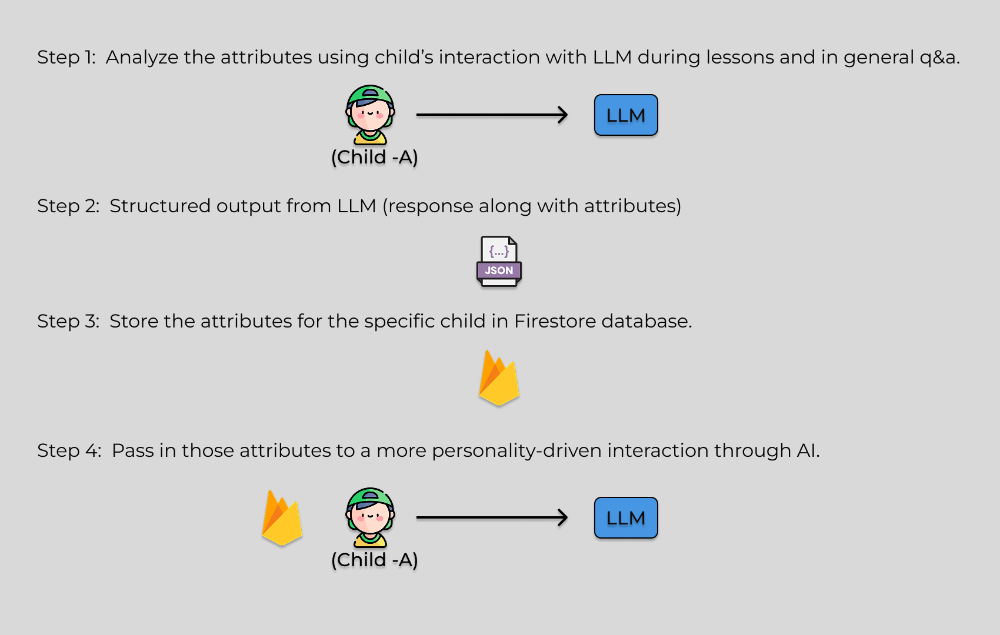
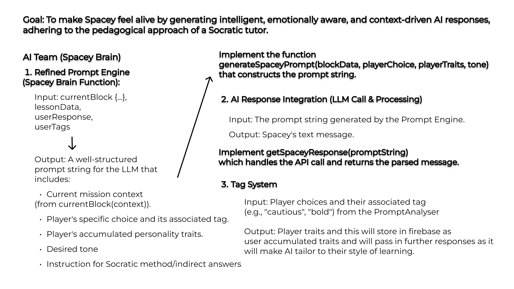
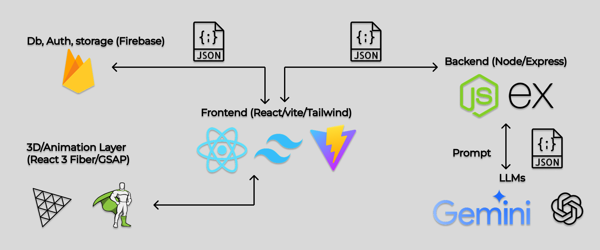

# 🚀 Spacey: AI Space Learning Platform

**Spacey** is an interactive, space-themed web application that makes learning about science and space fun, immersive, and personal. It combines a futuristic 3D UI, real-time AI chat, webcam-based emotion detection, and interactive lessons to create a next-generation educational experience.

---

## 🗂️ Monorepo Structure

```
spacey_demo_2/
  client/   # Frontend React app (Vite, Tailwind, 3D, AI chat, webcam, lessons)
  server/   # Backend Node.js/Express API (AI orchestration, user data, memory)
```

---

## ✨ Features

- **Immersive 3D UI**: Built with React Three Fiber for a beautiful, animated space environment.
- **AI Chatbot**: Real-time, context-aware AI assistant (Spacey) with personality, powered by multiple LLM providers.
- **Webcam Emotion Detection**: Uses face-api.js and TensorFlow.js for real-time emotion and trait analysis.
- **Personalized Lessons**: Interactive, branching lessons with AI feedback and user trait tracking.
- **User Authentication**: Secure sign up, login, and profile management via Firebase Auth.
- **Progress Tracking**: User progress, traits, and learning analytics stored in Firestore and backend memory.
- **Responsive Design**: Fully responsive, mobile-friendly UI with Tailwind CSS.
- **Protected Routes**: Dashboard, lessons, and profile pages require authentication.
- **Debug & Developer Tools**: Built-in debug panels and logs for development and testing.

---

## 🛠️ Tech Stack

### Frontend
- [React 19](https://react.dev/) + [Vite](https://vitejs.dev/)
- [React Router DOM](https://reactrouter.com/)
- [Tailwind CSS](https://tailwindcss.com/)
- [GSAP](https://greensock.com/gsap/) (animations)
- [react-three-fiber](https://github.com/pmndrs/react-three-fiber) (3D)
- [face-api.js](https://github.com/justadudewhohacks/face-api.js) & [TensorFlow.js](https://www.tensorflow.org/js) (emotion detection)
- [Firebase](https://firebase.google.com/) (auth, Firestore)

### Backend
- [Node.js](https://nodejs.org/) + [Express](https://expressjs.com/)
- [@google/genai](https://www.npmjs.com/package/@google/genai) (Gemini LLM)
- [OpenAI, HuggingFace, Together, Groq] (multi-provider AI support)
- [Axios](https://axios-http.com/) (API calls)
- [dotenv](https://www.npmjs.com/package/dotenv) (env config)

---

## ⚡ Quickstart

### 1. Prerequisites
- [Node.js](https://nodejs.org/) (v18+ recommended)
- [npm](https://www.npmjs.com/) (v9+ recommended)
- [Firebase project](https://firebase.google.com/) (for Auth & Firestore)

### 2. Clone the Repo
```bash
git clone <your-repo-url>
cd spacey_demo_2
```

### 3. Setup Environment Variables

#### Frontend (`client/.env`)
```
VITE_API_BASE_URL=http://localhost:5000
VITE_FIREBASE_API_KEY=your_firebase_api_key
VITE_FIREBASE_AUTH_DOMAIN=your_project.firebaseapp.com
VITE_FIREBASE_PROJECT_ID=your_project_id
VITE_FIREBASE_STORAGE_BUCKET=your_project.appspot.com
VITE_FIREBASE_MESSAGING_SENDER_ID=your_sender_id
VITE_FIREBASE_APP_ID=your_app_id
```

#### Backend (`server/.env`)
```
PORT=5000
DEFAULT_AI_PROVIDER=gemini
GOOGLE_API_KEY=your_google_genai_key
# Add other provider keys as needed (OPENAI_API_KEY, TOGETHER_API_KEY, etc)
```

### 4. Install Dependencies
```bash
# In project root
cd client && npm install
cd ../server && npm install
```

### 5. Run the App (Development)
```bash
# In one terminal (backend)
cd server && npm run dev

# In another terminal (frontend)
cd client && npm run dev
```
- Frontend: http://localhost:5173
- Backend API: http://localhost:5000/api/chat

---

## 🧑‍🚀 Usage
- Visit the frontend URL, sign up or log in.
- Explore the dashboard: interact with the AI, try webcam emotion detection, and start lessons.
- Progress and traits are tracked and personalized.

---

## 🛰️ API Overview

### Main Endpoints
- `POST /api/chat/spacey` — Main AI chat endpoint (handles standard, enhanced, avatar, and compliment chat types)
- `GET /api/chat/traits/:userId` — Get user personality traits
- `GET /api/chat/context/:userId` — Get conversation summary/context

#### Example Chat Payload
```json
{
  "prompt": "How do solar panels work on Mars?",
  "user": { "id": "user-id", "email": "user@example.com" },
  "type": "standard_chat" | "enhanced_chat" | "avatar_response" | "personalized_compliment",
  // ...additional context fields
}
```

---

## 🧩 Customization & Extending
- **Lessons**: Add new lessons as JSON in `client/public/lessons/`
- **3D Models**: Place GLB files in `client/public/models/`
- **Images/Audio**: Add to `client/public/images/` and `client/public/audio/`
- **AI Providers**: Configure new providers in `server/controllers/aiProviders.js` and set env keys

---

## 🤝 Contributing
1. Fork the repo & create a feature branch
2. Make your changes (with clear commits)
3. Test locally (both client & server)
4. Open a pull request with a clear description

---

## 📄 License
MIT (or your chosen license)

---

## 🙏 Credits
- Built by the Spacey team
- 3D assets, images, and sounds from open/free sources (see `/client/public`)
- Powered by open-source and cloud AI

---

## 🖼️ Visual System Overview

### 1. Voice Interaction Flow


### 2. AI Prompt & Socratic Tutor Engine


### 3. System Architecture


### 4. Personalized Learning Loop

